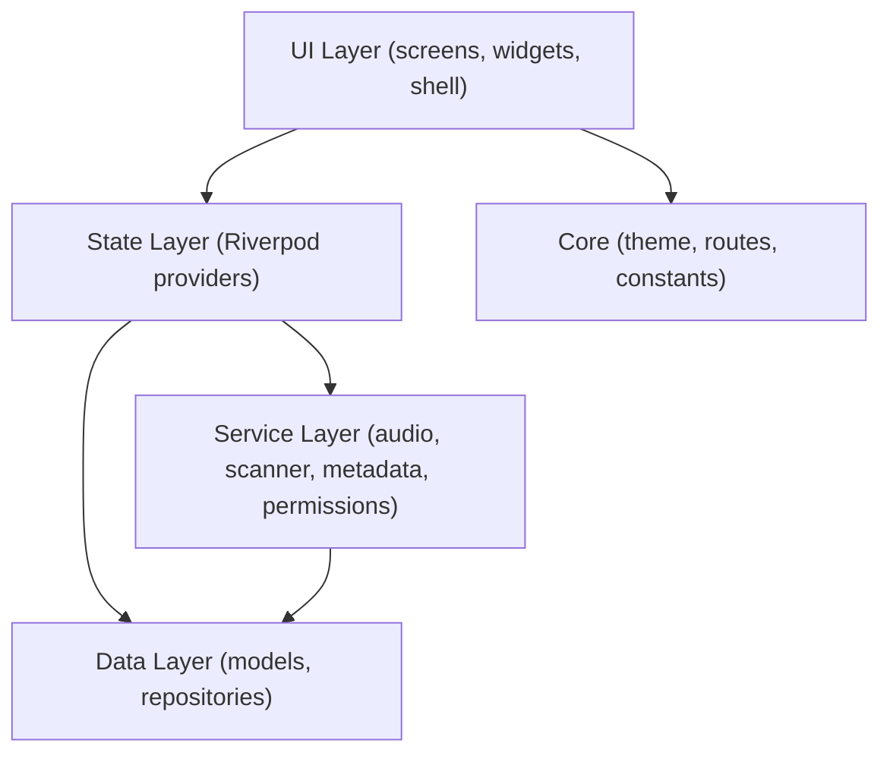

# SimPlayer — Project Analysis

## Overview

**SimPlayer** is a cross-platform local music player built with **Flutter**. It scans the device filesystem for audio files, extracts ID3/metadata, persists a song library in Hive, and plays audio through `just_audio`. The UI uses Material 3 with a custom dark/light theme system, glassmorphism effects, and Riverpod for state management.

---

## Architecture

The project follows a **layered architecture** with clean separation of concerns:

| Layer | Path | Purpose |
|---|---|---|
| **Core** | `lib/core/` | Theme, routing, constants |
| **Data** | `lib/data/` | Models (Hive-annotated) & repositories |
| **Services** | `lib/services/` | Audio playback, file scanning, metadata extraction, permissions |
| **Providers** | `lib/providers/` | Riverpod state management |
| **UI** | `lib/ui/` | Screens, reusable widgets, shell layout |

---

## Key Components

### Data Models
- **`Song`**: 18 fields incl. metadata, play stats, favorites. Hive-persisted with generated adapter.
- **`Playlist`**: Hive-persisted playlist with generated adapter.
- **`AppPlayerState`**: Immutable playback state: status, position, duration, volume, speed, repeat, shuffle.
- **`PlaybackQueue`**: Queue with shuffle support and original-order restoration.
- **`RichMetadata`**: Extended metadata structure.
- **`LibraryCategory`**: Categorization enum/model.

### Services
- **`AudioService`**: Wraps `just_audio`. Full playback control, queue management, shuffle/repeat, fade effects, queue persistence in Hive.
- **`FileScannerService`**: Recursive directory scanning, batch processing, progress streams, artwork extraction to cache, cancellation support.
- **`MetadataService`**: Uses `audio_metadata_reader` for cross-platform tag extraction.
- **`PermissionService`**: Handles storage permission flow.

### Repositories
- **`SongRepository`**: Provides persistence for songs using Hive. Utilizes an internal `_pathIndex` (hash map) to achieve **O(1) lookups** for file paths, dramatically improving scan performance.

### UI Screens
- **Home (`home_screen.dart`)**: Dashboard with recently added/played, most played sections.
- **Library (`library_screen.dart`)**: Browse by artists, albums, genres, folders.
- **Now Playing (`now_playing_screen.dart`)**: Full-screen player with artwork, controls, seek.
- **Settings (`settings_screen.dart` + `settings/`)**: Extensive modular settings (audio, scanning, UI, headset, sleep timer). Decomposed into clean modular components.
- **Playlists (`playlists_screen.dart`)**: Playlist CRUD and management.
- **Queue (`queue_screen.dart`)**: Drag-to-reorder queue.
- **Search (`search_screen.dart`)**: Real-time search across songs.
- **Splash (`splash_screen.dart`)**: Animated splash with init loading & robust error fallback.

---

## Tech Stack & Dependencies

| Category | Package | Purpose |
|---|---|---|
| State Mgmt | `flutter_riverpod` 3.3.2 | Providers for reactive state |
| Audio | `just_audio` 0.10.6 | Core playback engine |
| Audio | `audio_session` 0.2.4 | Audio session configuration |
| Audio | `audio_service` 0.18.15 | Media notification/controls |
| Storage | `hive` 2.2.3 + `hive_flutter` | Local NoSQL database |
| Metadata | `audio_metadata_reader` 1.4.2 | Pure-Dart tag extraction |
| UI | `shimmer` | Loading effects |

*Note: Cleaned up unused packages `go_router`, `just_audio_background`, and `cached_network_image` from the manifest to reduce bloat.*

---

## 4. Code Quality & Technical Debt

### Current State
*   **Static Analysis:** The project is 100% clean. `flutter analyze` reports **0 issues**.
*   **Dependencies:** Unused dependencies (`go_router`, `just_audio_background`, `cached_network_image`) have been removed, making the build leaner.
*   **Settings Screen:** The formerly monolithic 1194-line `settings_screen.dart` has been decomposed into smaller, modular section widgets in `lib/ui/screens/settings/`.
*   **Path Management:** Hardcoded Android paths in the `FileScannerService` and default settings have been replaced with platform-agnostic defaults using `path_provider`.

### Known Technical Debt
*   **Deprecated Widgets:** `RadioListTile.groupValue` is deprecated in Flutter 3.22+ and currently suppressed via `// ignore` comments. Future updates should migrate these to the new `RadioGroup` widget pattern.
*   **Missing Tests:** There are currently zero unit or widget tests. A testing strategy needs to be implemented.
*   **Error Handling:** While some silent catches were fixed, a centralized error tracking or reporting service could be beneficial.

